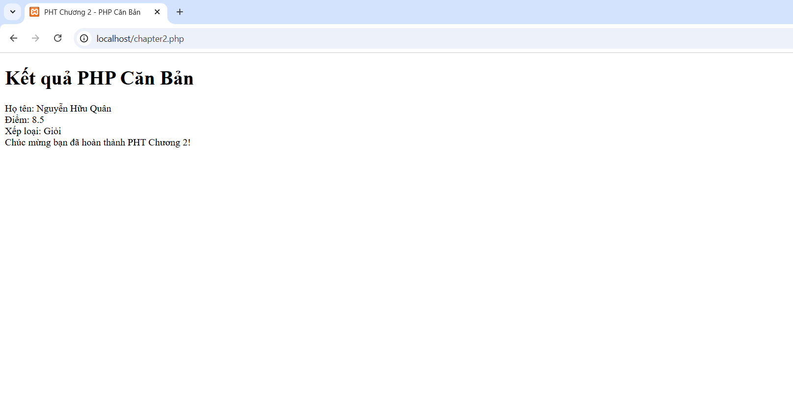
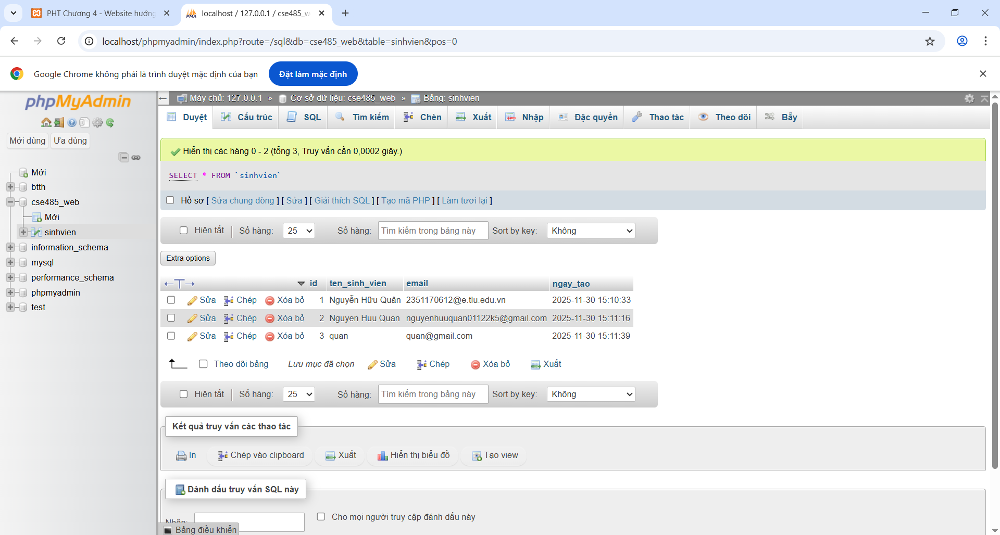
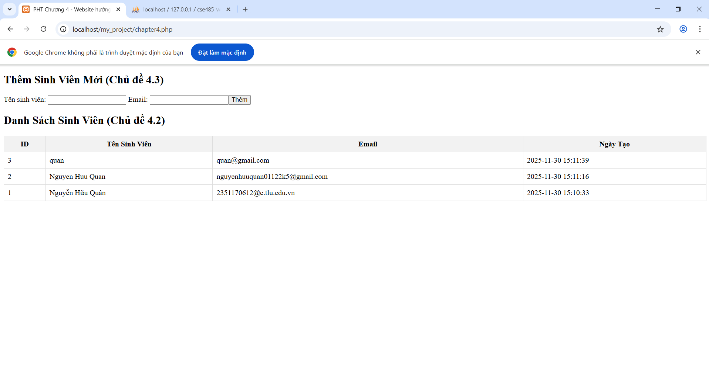
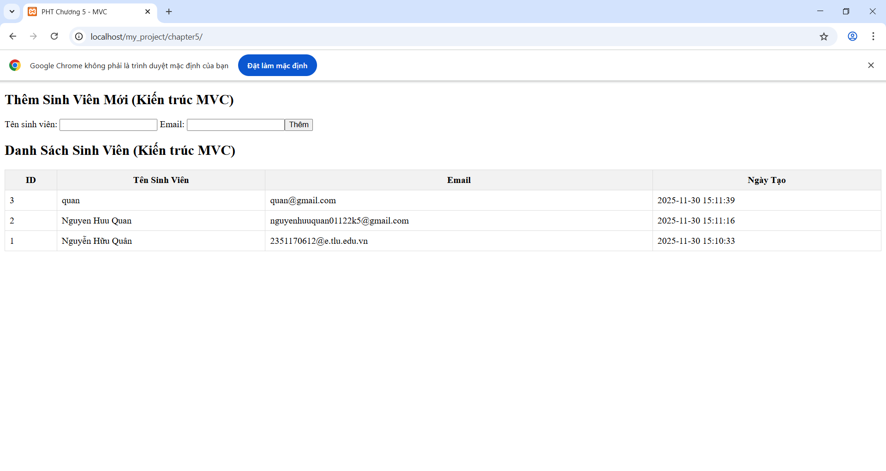
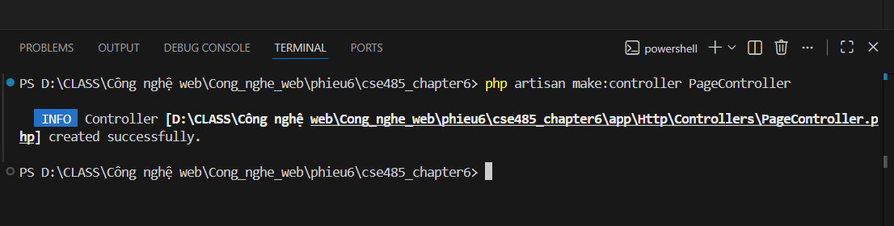
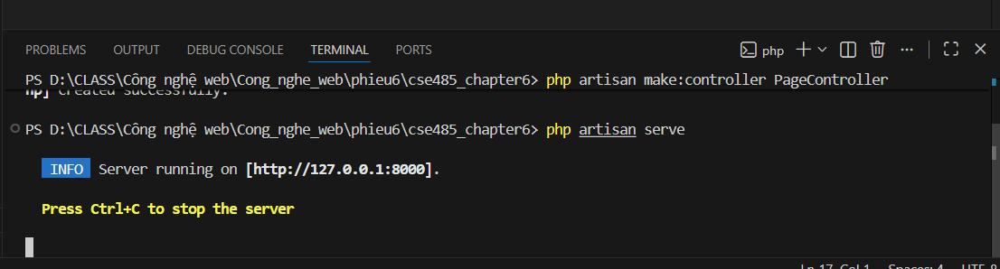
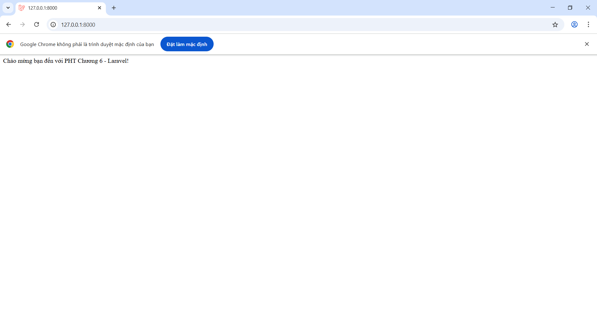
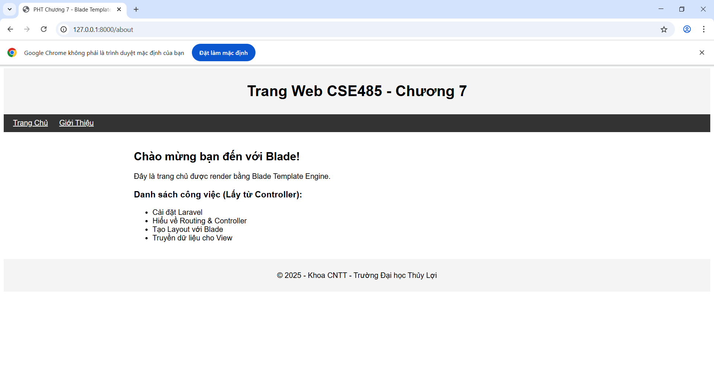

# Cong_nghe_web

Bài tập web

# PHIẾU HỌC TẬP CHỦ ĐỘNG (PHT)

# Môn học: CSE485: Công nghệ Web

# CHƯƠNG 1: TÌM HIỂU VỀ CÔNG NGHỆ WEB 4

A. Ảnh chụp màn hình Kết quả (Trình duyệt Web):

B. Thông tin trích xuất:

1. Request URL: https://tlu.edu.vn/
2. Request Method: GET
3. Status Code: 200 OK

Câu hỏi Phản biện:
Tại sao khi tôi refresh lại trang (F5), trình duyệt vẫn phải gửi thêm một số request mới như thời gian lại ít hơn (như có những request tốn 1-2 ms thì sau khi F5 thì chỉ tốn khoảng thời gian gần như bằng 0) thì có phải sever lấy những tài nguyên đã được lưu trong bộ nhớ cache trước đó không ?

# CHƯƠNG 2: LẬP TRÌNH PHP CĂN BẢN

A. Code đã hoàn thiện:

```php
<!DOCTYPE html>
<html lang="vi">

<head>
    <meta charset="UTF-8">
    <title>PHT Chương 2 - PHP Căn Bản</title>
</head>

<body>
    <h1>Kết quả PHP Căn Bản</h1>

    <?php
    // =============================
    // TODO 1: Khai báo 3 biến
    // =============================
    $ho_ten = "Nguyễn Hữu Quân";
    $diem_tb = 8.5;
    $co_di_hoc_chuyen_can = true;

    // =============================
    // TODO 2: In ra thông tin sinh viên
    // =============================
    echo "Họ tên: $ho_ten<br>";
    echo "Điểm: $diem_tb<br>";

    // =============================
    // TODO 3: Viết cấu trúc IF/ELSE IF/ELSE để xếp loại
    // =============================
    if ($diem_tb >= 8.5 && $co_di_hoc_chuyen_can) {
        echo "Xếp loại: Giỏi<br>";
    } elseif ($diem_tb >= 6.5 && $co_di_hoc_chuyen_can) {
        echo "Xếp loại: Khá<br>";
    } elseif ($diem_tb >= 5.0 && $co_di_hoc_chuyen_can) {
        echo "Xếp loại: Trung bình<br>";
    } else {
        echo "Xếp loại: Yếu (Cần cố gắng thêm!)<br>";
    }

    // =============================
    // TODO 4: Viết hàm đơn giản chaoMung()
    // =============================
    function chaoMung()
    {
        echo "Chúc mừng bạn đã hoàn thành PHT Chương 2!";
    }

    // =============================
    // TODO 5: Gọi hàm
    // =============================
    chaoMung();
    ?>
</body>

</html>
```

B. Ảnh chụp màn hình Kết quả (Trình duyệt Web):



Câu hỏi Phản biện:
Trong PHP, bạn có thể tạo và sử dụng hàm (function) mà không cần lớp và đối tượng. Vậy lợi ích chính
của việc sử dụng Lớp và Đối tượng (OOP) trong PHP là gì?Trong tình huống nào OOP giúp code PHP trở
nên dễ quản lý và tái sử dụng hơn so với chỉ dùng hàm thuần túy?

# CHƯƠNG 3: TRANG WEB ĐỘNG

A. Code đã hoàn thiện:
handle_login.php

```php
<?php
// TODO 1: (Cực kỳ quan trọng) Khởi động session
// Phải gọi hàm này TRƯỚC BẤT KỲ output HTML nào
// Gợi ý: Dùng hàm session_...()

session_start();

// TODO 2: Kiểm tra xem người dùng đã nhấn nút "Đăng nhập" (gửi form) chưa
// Gợi ý: Dùng hàm isset() để kiểm tra sự tồn tại của $_POST['username']

if (isset($_POST['username']) && isset($_POST['password'])) {

    // TODO 3: Nếu đã gửi form, lấy dữ liệu 'username' và 'password' từ $_POST
    // Gợi ý: $_POST['...']

    $user = $_POST['username'];
    $pass = $_POST['password'];

    // TODO 4: (Giả lập) Kiểm tra logic đăng nhập
    // Nếu $user == 'admin' VÀ $pass == '123' thì là đăng nhập thành công

    if ($user === 'admin' && $pass === '123') {

        // TODO 5: Nếu thành công, lưu tên username vào SESSION
        // Gợi ý: $_SESSION['ten_ban_dat'] = $user;

        $_SESSION['username'] = $user;

        // TODO 6: Chuyển hướng người dùng sang trang "chào mừng"
        // Gợi ý: Dùng hàm header('Location: ...');

        header('Location: welcome.php');

        // Và luôn gọi exit() ngay sau khi dùng header()

        exit();
    } else {

        // Nếu thất bại, chuyển hướng về login.html

        header('Location: login.html?error=1'); // Kèm theo thông báo lỗi trên URL
        exit;
    }
}
// TODO 7: Nếu người dùng truy cập trực tiếp file này (không qua POST),

header('Location: login.html');
exit;

// "đá" họ về trang login.html
// Gợi ý: Dùng else cho TODO 2 và cũng header() về login.html

?>
```

welcome.php

```php
<?php
// TODO 1: Khởi động session (BẮT BUỘC ở mọi trang cần dùng SESSION)
// Gợi ý: Dùng hàm session_...()

session_start();

// TODO 2: Kiểm tra xem SESSION (lưu tên đăng nhập) có tồn tại không?
// Gợi ý: Dùng isset($_SESSION['...']) (dùng đúng tên bạn đặt ở Tệp 2, TODO 5)

if (isset($_SESSION['username'])) {

   // TODO 3: Nếu tồn tại, lấy username từ SESSION ra

   $loggedInUser = $_SESSION['username'];

   // TODO 4: In ra lời chào mừng

   echo "<h1>Chào mừng trở lại, $loggedInUser!</h1>";
   echo "<p>Bạn đã đăng nhập thành công.</p>";

   // TODO 5: (Tạm thời) Tạo 1 link để "Đăng xuất" (chỉ là quay về login.html)

   echo '<a href="login.html">Đăng xuất (Tạm thời)</a>';
} else {
   // TODO 6: Nếu không tồn tại SESSION (chưa đăng nhập)

   header('Location: login.html');

   // Chuyển hướng người dùng về trang login.html
   // Gợi ý: Dùng header('Location: ...');

   exit;
}
?>
```

B. Ảnh chụp màn hình Kết quả (Trình duyệt Web):


Câu hỏi Phản biện:
Tại sao hàm session_start() phải được gọi ở cả file handle_login.php và file welcome.php để quản lý trạng thái đăng nhập của người dùng?

# CHƯƠNG 4: WEBSITE HƯỚNG DỮ LIỆU

A. Code đã hoàn thiện:

```php
<?php
// === THIẾT LẬP KẾT NỐI PDO ===
$host = '127.0.0.1'; // hoặc localhost
$dbname = 'cse485_web'; // Tên CSDL bạn vừa tạo
$username = 'root'; // Username mặc định của XAMPP
$password = ''; // Password mặc định của XAMPP (rỗng)
$dsn = "mysql:host=$host;dbname=$dbname;charset=utf8mb4";
try {
    // TODO 1: Tạo đối tượng PDO để kết nối CSDL
    // Gợi ý: $pdo = new PDO(...);
    $pdo = new PDO($dsn, $username, $password);
    $pdo->setAttribute(PDO::ATTR_ERRMODE, PDO::ERRMODE_EXCEPTION);
    // echo "Kết nối thành công!"; // (Bỏ comment để test)
} catch (PDOException $e) {
    die("Kết nối thất bại: " . $e->getMessage());
}
// === LOGIC THÊM SINH VIÊN (XỬ LÝ FORM POST) ===
// TODO 2: Kiểm tra xem form đã được gửi đi (method POST) và có 'ten_sinh_vien' không
// Gợi ý: Dùng isset($_POST['...'])
if (isset($_POST['ten_sinh_vien']) && isset($_POST['email'])) {
    // TODO 3: Lấy dữ liệu 'ten_sinh_vien' và 'email' từ $_POST
    $ten = $_POST['ten_sinh_vien'];
    $email = $_POST['email'];
    // TODO 4: Viết câu lệnh SQL INSERT với Prepared Statement (dùng dấu ?)
    $sql = "INSERT INTO sinhvien (ten_sinh_vien, email) VALUES (?, ?)";
    // TODO 5: Chuẩn bị (prepare) và thực thi (execute) câu lệnh
    // Gợi ý: $stmt = $pdo->prepare($sql);
    // Gợi ý: $stmt->execute([$ten, $email]);
    $stmt = $pdo->prepare($sql);
    $stmt->execute([$ten, $email]);
    // TODO 6: (Tùy chọn) Chuyển hướng về chính trang này để "làm mới"
    // Gợi ý: Dùng header('Location: chapter4.php');
    header('Location: chapter4.php');
    exit;
}
// === LOGIC LẤY DANH SÁCH SINH VIÊN (SELECT) ===
// TODO 7: Viết câu lệnh SQL SELECT *
$sql_select = "SELECT * FROM sinhvien ORDER BY ngay_tao DESC";
// TODO 8: Thực thi câu lệnh SELECT (không cần prepare vì không có tham số)
// Gợi ý: $stmt_select = $pdo->query($sql_select);
$stmt_select = $pdo->query($sql_select);
?>
<!DOCTYPE html>
<html lang="vi">

<head>
    <meta charset="UTF-8">
    <title>PHT Chương 4 - Website hướng dữ liệu</title>
    <style>
        table {
            width: 100%;
            border-collapse: collapse;
        }

        th,
        td {
            border: 1px solid #ddd;
            padding: 8px;
        }

        th {
            background-color: #f2f2f2;
        }
    </style>
</head>

<body>
    <h2>Thêm Sinh Viên Mới (Chủ đề 4.3)</h2>
    <form action="chapter4.php" method="POST">
        Tên sinh viên: <input type="text" name="ten_sinh_vien" required>
        Email: <input type="email" name="email" required><button type="submit">Thêm</button>
    </form>
    <h2>Danh Sách Sinh Viên (Chủ đề 4.2)</h2>
    <table>
        <tr>
            <th>ID</th>
            <th>Tên Sinh Viên</th>
            <th>Email</th>
            <th>Ngày Tạo</th>
        </tr>
        <?php
        // TODO 9: Dùng vòng lặp (ví dụ: while) để duyệt qua kết quả
        // Gợi ý: while ($row = $stmt_select->fetch(PDO::FETCH_ASSOC)) { ... }
        while ($row = $stmt_select->fetch(PDO::FETCH_ASSOC)) {

            // TODO 10: In (echo) các dòng <tr> và <td> chứa dữ liệu $row
            // Gợi ý: echo "<tr>";
            // Gợi ý: echo "<td>" . htmlspecialchars($row['id']) . "</td>";
            echo "<tr>";
            echo "<td>" . htmlspecialchars($row['id']) . "</td>";
            echo "<td>" . htmlspecialchars($row['ten_sinh_vien']) . "</td>";
            echo "<td>" . htmlspecialchars($row['email']) . "</td>";
            echo "<td>" . htmlspecialchars($row['ngay_tao']) . "</td>";
            echo "</tr>";
        }
        // (htmlspecialchars là để bảo mật, tránh lỗi XSS - sẽ học ở Chương 9)
        // Đóng vòng lặp
        ?>
    </table>
</body>

</html>
```

B. Ảnh chụp màn hình Kết quả:

1. Ảnh 1 (phpMyAdmin):
   
2. Ảnh 2 (Trình duyệt Web):
   
   Câu hỏi Phản biện:

# CHƯƠNG 5: MỞ RỘNG ỨNG DỤNG (TẬP TRUNG VÀO 5.1 TÁI CẤU TRÚC & 5.5 MÔ HÌNH MVC)

A. Code đã hoàn thiện: Dán (paste) toàn bộ code của cả 3 tệp bạn đã sửa:

1. models/SinhVienModel.php

```php
<?php
// Tệp Model sẽ chứa tất cả logic truy vấn CSDL
// TODO 1: Viết 1 hàm tên là getAllSinhVien()
// Hàm này nhận 1 tham số là $pdo (đối tượng PDO)
// Bên trong hàm, thực thi câu lệnh SELECT * FROM sinhvien
// Hàm trả về kết quả (dùng fetchAll)
function getAllSinhVien($pdo)
{
    // Gợi ý:
    // $sql = "SELECT * FROM sinhvien";

    $sql = "SELECT * FROM sinhvien ORDER BY ngay_tao DESC";

    // $stmt = $pdo->query($sql);

    $stmt = $pdo->query($sql);

    // return $stmt->fetchAll(PDO::FETCH_ASSOC);

    return $stmt->fetchAll(PDO::FETCH_ASSOC);
}
// TODO 2: Viết 1 hàm tên là addSinhVien()
// Hàm này nhận 3 tham số: $pdo, $ten, $email
// Bên trong hàm, thực thi câu lệnh INSERT (dùng Prepared Statement)// Gợi ý:
// $sql = "INSERT INTO sinhvien (ten_sinh_vien, email) VALUES (?, ?)";
// $stmt = $pdo->prepare($sql);
// $stmt->execute([$ten, $email]);

function addSinhVien($pdo, $ten, $email)
{
    $sql = "INSERT INTO sinhvien (ten_sinh_vien, email) VALUES ($ten, $email)";
    $stmt = $pdo->prepare($sql);
    $stmt->execute([$ten, $email]);
}
?>
```

2. views/sinhvien_view.php

```php
<?php
// Tệp View CHỈ chứa HTML và logic hiển thị (echo, foreach)
// Tệp View KHÔNG chứa câu lệnh SQL
?>
<!DOCTYPE html>
<html lang="vi">

<head>
    <meta charset="UTF-8">
    <title>PHT Chương 5 - MVC</title>
    <style>
        table {
            width: 100%;
            border-collapse: collapse;
        }

        th,
        td {
            border: 1px solid #ddd;
            padding: 8px;
        }

        th {
            background-color: #f2f2f2;
        }
    </style>
</head>

<body>
    <h2>Thêm Sinh Viên Mới (Kiến trúc MVC)</h2>
    <form action="index.php" method="POST">
        Tên sinh viên: <input type="text" name="ten_sinh_vien" required>
        Email: <input type="email" name="email" required><button type="submit">Thêm</button>
    </form>
    <h2>Danh Sách Sinh Viên (Kiến trúc MVC)</h2>
    <table>
        <tr>
            <th>ID</th>
            <th>Tên Sinh Viên</th>
            <th>Email</th>
            <th>Ngày Tạo</th>
        </tr><?php
                // TODO 4: Dùng vòng lặp foreach để duyệt qua biến $danh_sach_sv
                // (Biến $danh_sach_sv này sẽ được Controller truyền sang)
                // Gợi ý: foreach ($danh_sach_sv as $sv) { ... }
                foreach ($danh_sach_sv as $sv) {
                    // TODO 5: In (echo) các dòng <tr> và <td> chứa dữ liệu $sv
                    // Gợi ý: echo "<tr><td>" . htmlspecialchars($sv['id']) .

                    echo "<tr>";
                    echo "<td>" . htmlspecialchars($sv['id']) . "</td>";
                    echo "<td>" . htmlspecialchars($sv['ten_sinh_vien']) . "</td>";
                    echo "<td>" . htmlspecialchars($sv['email']) . "</td>";
                    echo "<td>" . htmlspecialchars($sv['ngay_tao']) . "</td>";
                    echo "</tr>";
                    // Đóng vòng lặp
                }
                ?>
    </table>
</body>

</html>
?>
```

3. index.php

```php
<?php
// Tệp Controller là "não" của ứng dụng
// TODO 6: (Quan trọng) Import (require_once) tệp Model vào
// Gợi ý: require_once 'models/SinhVienModel.php';

require_once 'models/SinhVienModel.php"';

// === THIẾT LẬP KẾT NỐI PDO ===
// TODO 7: Copy code PDO từ PHT Chương 4 vào đây
$host = '127.0.0.1';
$dbname = 'cse485_web';
$username = 'root';
$password = '';
$dsn = "mysql:host=$host;dbname=$dbname;charset=utf8mb4";
try {
    $pdo = new PDO($dsn, $username, $password);
    $pdo->setAttribute(PDO::ATTR_ERRMODE, PDO::ERRMODE_EXCEPTION);
} catch (PDOException $e) {
    die("Kết nối thất bại: " . $e->getMessage());
}
// === KẾT THÚC KẾT NỐI PDO ===
// === LOGIC CỦA CONTROLLER ===
// TODO 8: Kiểm tra  xem có hành động POST (thêm sinh viên) không
// Gợi ý: Dùng isset($_POST['ten_sinh_vien'])
if (isset($_POST['ten_sinh_vien'])) {
    // TODO 9: Nếu có, lấy $ten và $email từ $_POST
    $ten = $_POST['ten_sinh_vien'];
    $email = $_POST['email'];
    // TODO 10: Gọi hàm addSinhVien() từ Model
    // (Truyền $pdo, $ten, $email vào hàm)
    // Gợi ý: addSinhVien($pdo, $ten, $email);
    addSinhVien($pdo, $ten, $email);
    // TODO 11: Chuyển hướng về index.php để "làm mới" trang
    // Gợi ý: header('Location: index.php');
    header('Location: index.php');
    exit;
}
// TODO 12: (Luôn luôn) Gọi hàm getAllSinhVien() từ Model
// (Truyền $pdo vào hàm)
// Lưu kết quả trả về vào một biến, ví dụ: $danh_sach_sv
// Gợi ý: $danh_sach_sv = getAllSinhVien($pdo);
$danh_sach_sv = getAllSinhVien($pdo);


// TODO 13: (Rất quan trọng) Import (include) tệp View ở cuối cùng
// Tệp View sẽ tự động "nhìn thấy" biến $danh_sach_sv mà ta vừa tạo
// Gợi ý: include 'views/sinhvien_view.php';

include 'views/sinhvien_view.php';
?>
```

B. Ảnh chụp màn hình Kết quả (Trình duyệt Web):

Câu hỏi Phản biện:
Khi mình thêm dữ liệu thì mình include lại views/sinhvien_view.php thì dữ liệu có bị xếp trồng lên không?

# CHƯƠNG 6: GIỚI THIỆU VỀ LARAVEL

A. Code đã hoàn thiện:

1. Dán (paste) toàn bộ code của tệp app/Http/Controllers/PageController.php.

```php
<?php

namespace App\Http\Controllers;

use Illuminate\Http\Request;

class PageController extends Controller
{
    // TODO 8: Thêm phương thức này
    public function showHomepage()
    {
        // TODO 9: Thay vì echo, chúng ta 'return'
        return "Chào mừng bạn đến với PHT Chương 6 - Laravel!";
    }
}
?>
```

2. Dán (paste) toàn bộ code của tệp routes/web.php.

```php
<?php


use Illuminate\Support\Facades\Route;
use App\Http\Controllers\PageController;

// TODO 12: Xóa Route Route::get('/', ...); mặc định. Thay vào đó, thêm 2
// Route mới:
// o Một Route cho URL / (trang chủ).
// o Một Route cho URL /about.
// o Cả hai đều trỏ đến PageController@showHomepage (chúng ta sẽ dùng
// chung 1 hàm cho PHT này).

// TODO 12: Thêm 2 route này
Route::get('/', [PageController::class, 'showHomepage']);
Route::get('/about', [PageController::class, 'showHomepage']);
?>
```

B. Ảnh chụp màn hình Kết quả (3 ẢNH):

1. Ảnh 1 (Terminal): Chụp màn hình Terminal sau khi chạy lệnh php artisan
   make:controller PageController thành công.
   
2. Ảnh 2 (Terminal): Chụp màn hình Terminal đang chạy lệnh php artisan serve.
   
3. Ảnh 3 (Trình duyệt Web): Chụp ảnh màn hình trình duyệt truy cập vào
   http://127.0.0.1:8000/ (phải thấy thông điệp chào mừng bạn đã return ở TODO 9).
   

Câu hỏi Phản biện:

# CHƯƠNG 7: TẠO KHUÔN MẪU VỚI BLADE

A. Code đã hoàn thiện: Dán (paste) toàn bộ code của 3 tệp bạn đã tạo/sửa:

4. resources/views/layouts/app.blade.php

```php
<!DOCTYPE html>
<html lang="vi">

<head>
    <meta charset="UTF-8">
    <meta name="viewport" content="width=device-width, initial-scale=1.0">
    <title>{{ $title ?? 'Website Của Tôi' }}</title>
    <style>
        body {
            font-family: sans-serif;
        }

        .container {
            max-width: 960px;
            margin: 0 auto;
            padding: 20px;
        }

        header,
        footer {
            background-color: #f4f4f4;
            padding: 10px;
            text-align:
                center;
        }

        nav {
            background-color: #333;
            color: white;
            padding: 10px;
        }

        nav a {
            color: white;
            margin: 0 10px;
        }
    </style>
</head>

<body>
    <header>
        <h1>Trang Web CSE485 - Chương 7</h1>
    </header>
    <nav>
        <a href="/">Trang Chủ</a>
        <a href="/about">Giới Thiệu</a>
    </nav>
    <div class="container">
        @yield('content')
    </div>
    <footer>
        <p>&copy; 2025 - Khoa CNTT - Trường Đại học Thủy Lợi</p>
    </footer>
</body>

</html>
```

5. resources/views/homepage.blade.php

```php
@extends('layouts.app')
@section('content')
<h2>{{ $page_title }}</h2>
<p>{{ $page_description }}</p>
<h3>Danh sách công việc (Lấy từ Controller):</h3>
<ul>
    @foreach($tasks as $task)
    <li>{{ $task }}</li>
    @endforeach
</ul>
@endsection
```

6. app/Http/Controllers/PageController.php

```php
<?php

namespace App\Http\Controllers;

use Illuminate\Http\Request;

class PageController extends Controller
{
    // Sửa phương thức showHomepage() của Chương 6
    public function showHomepage()
    {
        // TODO 7: Thay vì "return 'Chào mừng...'", chúng ta sẽ
        // chuẩn bị dữ liệu để truyền cho View
        $viewTitle = 'PHT Chương 7 - Blade Template';
        $pageTitle = 'Chào mừng bạn đến với Blade!';
        $pageDescription = 'Đây là trang chủ được render bằng Blade Template
Engine.';
        $tasks = [
            'Cài đặt Laravel',
            'Hiểu về Routing & Controller',
            'Tạo Layout với Blade',
            'Truyền dữ liệu cho View'
        ];
        // TODO 8: Trả về một View
        // Gợi ý: Dùng hàm view('ten_view', $data_array)
        // 'homepage' tương đương 'homepage.blade.php'
        return view('homepage', [
            'title' => $viewTitle,
            'page_title' => $pageTitle,
            'page_description' => $pageDescription,
            'tasks' => $tasks
        ]);
        // TODO 9: (Cách khác) Dùng hàm compact() cho gọn
        // return view('homepage', compact('viewTitle', 'pageTitle','pageDescription', 'tasks'));
        // (Lưu ý: khi dùng compact, tên biến ở Controller và View phải khớp nhau)
    }
}
?>
```

B. Ảnh chụp màn hình Kết quả (Trình duyệt Web): Chạy php artisan serve và truy cập
http://127.0.0.1:8000/. Chụp ảnh màn hình trình duyệt hiển thị kết quả. (Phải thấy rõ layout
chung (header/footer) và phần nội dung (danh sách công việc) được nạp ở giữa).


Câu hỏi Phản biện:

# CHƯƠNG 8: ELOQUENT ORM

A. Code đã hoàn thiện:

1. Dán (paste) code hàm up() trong file Migration (...\_create_sinh_viens_table.php).
2. Dán (paste) toàn bộ code file app/Models/SinhVien.php.
3. Dán (paste) toàn bộ code file app/Http/Controllers/SinhVienController.php.
4. Dán (paste) code 2 route trong routes/web.php.

B. Ảnh chụp màn hình Kết quả (3 ẢNH):

5. Ảnh 1 (Terminal): Chụp màn hình Terminal sau khi chạy php artisan make:model ... -m
   VÀ php artisan migrate thành công.
   
6. Ảnh 2 (phpMyAdmin): Chụp màn hình tab "Structure" (Cấu trúc) của bảng sinh_viens
   trong CSDL, cho thấy rõ các cột id, ten_sinh_vien, email, created_at.
   
7. Ảnh 3 (Trình duyệt Web): Chụp ảnh màn hình trang /sinhvien, sau khi đã dùng form
   thêm 1-2 sinh viên (chứng minh ::create() và ::all() đều hoạt động).
   

# CHƯƠNG 9: BẢO MẬT ỨNG DỤNG WEB

A. Code đã hoàn thiện:

1. Dán (paste) code của khối <form> trong tệp list.blade.php (chứng minh bạn đã thêm
   @csrf).
2. Dán (paste) code của khối @foreach trong tệp list.blade.php (chứng minh bạn dùng {{
   }}).

B. Ảnh chụp màn hình Kết quả (BẮT BUỘC 2 ẢNH):

3. Ảnh 1 (Bằng chứng Chống CSRF): Tải trang /sinhvien, nhấn chuột phải $\rightarrow$
   View Page Source (Xem nguồn trang). Chụp ảnh màn hình mã nguồn HTML, khoanh
   tròn vào thẻ <input type="hidden" name="\_token" ...> mà @csrf đã tự động tạo ra.
   
4. Ảnh 2 (Bằng chứng Chống XSS): Chụp ảnh màn hình trang /sinhvien sau khi bạn đã
   thêm sinh viên ở (TODO 6 & 7). Ảnh phải cho thấy dòng chữ <script>alert('Ban da bi
   XSS!');</script> được in ra dưới dạng text trên bảng, chứ KHÔNG CÓ popup "alert"
   nào hiện lên.
   

   Câu hỏi Phản biện:
