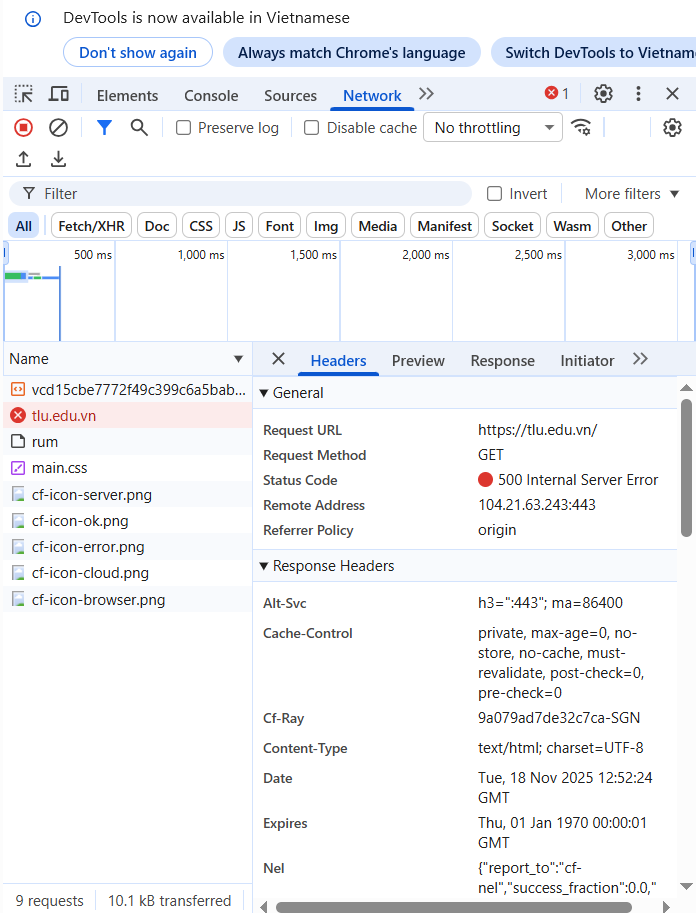

# Cong_nghe_web
Bài tập web

#                                             PHIẾU HỌC TẬP CHỦ ĐỘNG (PHT)
#                                          Môn học: CSE485: Công nghệ Web
# CHƯƠNG 1: TÌM HIỂU VỀ CÔNG NGHỆ WEB 4

A. Ảnh chụp màn hình Kết quả (Trình duyệt Web):

B. Thông tin trích xuất:

1. Request URL: https://tlu.edu.vn/
2. Request Method: GET
3. Status Code: 200 OK

Câu hỏi Phản biện:
Tại sao khi tôi refresh lại trang (F5), trình duyệt vẫn phải gửi thêm một số request mới như thời gian lại ít hơn (như có những request tốn 1-2 ms thì sau khi F5 thì chỉ tốn khoảng thời gian gần như bằng 0) thì có phải sever lấy những tài nguyên đã được lưu trong bộ nhớ cache trước đó không ?

# CHƯƠNG 2: LẬP TRÌNH PHP CĂN BẢN

A. Code đã hoàn thiện: 
```php
<!DOCTYPE html>
<html lang="vi">

<head>
    <meta charset="UTF-8">
    <title>PHT Chương 2 - PHP Căn Bản</title>
</head>

<body>
    <h1>Kết quả PHP Căn Bản</h1>

    <?php
    // =============================
    // TODO 1: Khai báo 3 biến
    // =============================
    $ho_ten = "Nguyễn Văn A";
    $diem_tb = 7.5;
    $co_di_hoc_chuyen_can = true;

    // =============================
    // TODO 2: In ra thông tin sinh viên
    // =============================
    echo "Họ tên: $ho_ten<br>";
    echo "Điểm: $diem_tb<br>";

    // =============================
    // TODO 3: Viết cấu trúc IF/ELSE IF/ELSE để xếp loại
    // =============================
    if ($diem_tb >= 8.5 && $co_di_hoc_chuyen_can) {
        echo "Xếp loại: Giỏi<br>";
    } elseif ($diem_tb >= 6.5 && $co_di_hoc_chuyen_can) {
        echo "Xếp loại: Khá<br>";
    } elseif ($diem_tb >= 5.0 && $co_di_hoc_chuyen_can) {
        echo "Xếp loại: Trung bình<br>";
    } else {
        echo "Xếp loại: Yếu (Cần cố gắng thêm!)<br>";
    }

    // =============================
    // TODO 4: Viết hàm đơn giản chaoMung()
    // =============================
    function chaoMung()
    {
        echo "Chúc mừng bạn đã hoàn thành PHT Chương 2!";
    }

    // =============================
    // TODO 5: Gọi hàm
    // =============================
    chaoMung();
    ?>
</body>

</html>





Câu hỏi Phản biện:
Trong PHP, bạn có thể tạo và sử dụng hàm (function) mà không cần lớp và đối tượng. Vậy lợi ích chính
của việc sử dụng Lớp và Đối tượng (OOP) trong PHP là gì?Trong tình huống nào OOP giúp code PHP trở
nên dễ quản lý và tái sử dụng hơn so với chỉ dùng hàm thuần túy?
