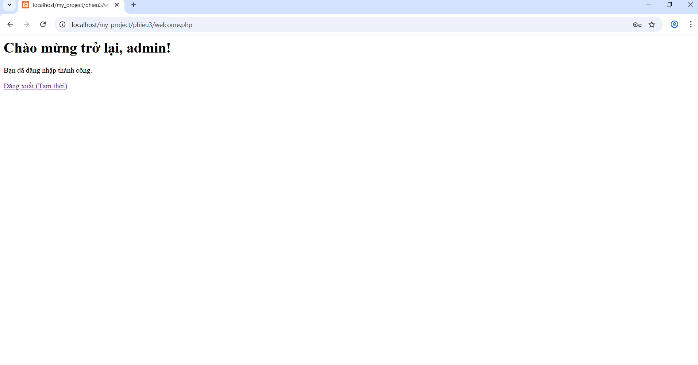

# Cong_nghe_web
Bài tập web

#                                             PHIẾU HỌC TẬP CHỦ ĐỘNG (PHT)
#                                          Môn học: CSE485: Công nghệ Web
# CHƯƠNG 1: TÌM HIỂU VỀ CÔNG NGHỆ WEB 4

A. Ảnh chụp màn hình Kết quả (Trình duyệt Web):

B. Thông tin trích xuất:

1. Request URL: https://tlu.edu.vn/
2. Request Method: GET
3. Status Code: 200 OK

Câu hỏi Phản biện:
Tại sao khi tôi refresh lại trang (F5), trình duyệt vẫn phải gửi thêm một số request mới như thời gian lại ít hơn (như có những request tốn 1-2 ms thì sau khi F5 thì chỉ tốn khoảng thời gian gần như bằng 0) thì có phải sever lấy những tài nguyên đã được lưu trong bộ nhớ cache trước đó không ?

# CHƯƠNG 2: LẬP TRÌNH PHP CĂN BẢN

A. Code đã hoàn thiện: 
```php
<!DOCTYPE html>
<html lang="vi">

<head>
    <meta charset="UTF-8">
    <title>PHT Chương 2 - PHP Căn Bản</title>
</head>

<body>
    <h1>Kết quả PHP Căn Bản</h1>

    <?php
    // =============================
    // TODO 1: Khai báo 3 biến
    // =============================
    $ho_ten = "Nguyễn Hữu Quân";
    $diem_tb = 8.5;
    $co_di_hoc_chuyen_can = true;

    // =============================
    // TODO 2: In ra thông tin sinh viên
    // =============================
    echo "Họ tên: $ho_ten<br>";
    echo "Điểm: $diem_tb<br>";

    // =============================
    // TODO 3: Viết cấu trúc IF/ELSE IF/ELSE để xếp loại
    // =============================
    if ($diem_tb >= 8.5 && $co_di_hoc_chuyen_can) {
        echo "Xếp loại: Giỏi<br>";
    } elseif ($diem_tb >= 6.5 && $co_di_hoc_chuyen_can) {
        echo "Xếp loại: Khá<br>";
    } elseif ($diem_tb >= 5.0 && $co_di_hoc_chuyen_can) {
        echo "Xếp loại: Trung bình<br>";
    } else {
        echo "Xếp loại: Yếu (Cần cố gắng thêm!)<br>";
    }

    // =============================
    // TODO 4: Viết hàm đơn giản chaoMung()
    // =============================
    function chaoMung()
    {
        echo "Chúc mừng bạn đã hoàn thành PHT Chương 2!";
    }

    // =============================
    // TODO 5: Gọi hàm
    // =============================
    chaoMung();
    ?>
</body>

</html>
```
B. Ảnh chụp màn hình Kết quả (Trình duyệt Web):


Câu hỏi Phản biện:
Trong PHP, bạn có thể tạo và sử dụng hàm (function) mà không cần lớp và đối tượng. Vậy lợi ích chính
của việc sử dụng Lớp và Đối tượng (OOP) trong PHP là gì?Trong tình huống nào OOP giúp code PHP trở
nên dễ quản lý và tái sử dụng hơn so với chỉ dùng hàm thuần túy?

# CHƯƠNG 3: TRANG WEB ĐỘNG
A. Code đã hoàn thiện:
handle_login.php
```php
<?php
// TODO 1: (Cực kỳ quan trọng) Khởi động session
// Phải gọi hàm này TRƯỚC BẤT KỲ output HTML nào
// Gợi ý: Dùng hàm session_...()

session_start();

// TODO 2: Kiểm tra xem người dùng đã nhấn nút "Đăng nhập" (gửi form) chưa
// Gợi ý: Dùng hàm isset() để kiểm tra sự tồn tại của $_POST['username']

if (isset($_POST['username']) && isset($_POST['password'])) {

    // TODO 3: Nếu đã gửi form, lấy dữ liệu 'username' và 'password' từ $_POST
    // Gợi ý: $_POST['...']

    $user = $_POST['username'];
    $pass = $_POST['password'];

    // TODO 4: (Giả lập) Kiểm tra logic đăng nhập
    // Nếu $user == 'admin' VÀ $pass == '123' thì là đăng nhập thành công

    if ($user === 'admin' && $pass === '123') {

        // TODO 5: Nếu thành công, lưu tên username vào SESSION
        // Gợi ý: $_SESSION['ten_ban_dat'] = $user;

        $_SESSION['username'] = $user;

        // TODO 6: Chuyển hướng người dùng sang trang "chào mừng"
        // Gợi ý: Dùng hàm header('Location: ...');

        header('Location: welcome.php');

        // Và luôn gọi exit() ngay sau khi dùng header()

        exit();
    } else {

        // Nếu thất bại, chuyển hướng về login.html

        header('Location: login.html?error=1'); // Kèm theo thông báo lỗi trên URL
        exit;
    }
}
// TODO 7: Nếu người dùng truy cập trực tiếp file này (không qua POST),

header('Location: login.html');
exit;

// "đá" họ về trang login.html
// Gợi ý: Dùng else cho TODO 2 và cũng header() về login.html

?>
```

 welcome.php
 ```php
<?php
// TODO 1: Khởi động session (BẮT BUỘC ở mọi trang cần dùng SESSION)
// Gợi ý: Dùng hàm session_...()

session_start();

// TODO 2: Kiểm tra xem SESSION (lưu tên đăng nhập) có tồn tại không?
// Gợi ý: Dùng isset($_SESSION['...']) (dùng đúng tên bạn đặt ở Tệp 2, TODO 5)

if (isset($_SESSION['username'])) {

    // TODO 3: Nếu tồn tại, lấy username từ SESSION ra

    $loggedInUser = $_SESSION['username'];

    // TODO 4: In ra lời chào mừng

    echo "<h1>Chào mừng trở lại, $loggedInUser!</h1>";
    echo "<p>Bạn đã đăng nhập thành công.</p>";

    // TODO 5: (Tạm thời) Tạo 1 link để "Đăng xuất" (chỉ là quay về login.html)

    echo '<a href="login.html">Đăng xuất (Tạm thời)</a>';
} else {
    // TODO 6: Nếu không tồn tại SESSION (chưa đăng nhập)

    header('Location: login.html');

    // Chuyển hướng người dùng về trang login.html
    // Gợi ý: Dùng header('Location: ...');

    exit;
}
?>
```
B. Ảnh chụp màn hình Kết quả (Trình duyệt Web): 


Câu hỏi Phản biện:
Tại sao hàm session_start() phải được gọi ở cả file handle_login.php và file welcome.php để quản lý trạng thái đăng nhập của người dùng?
